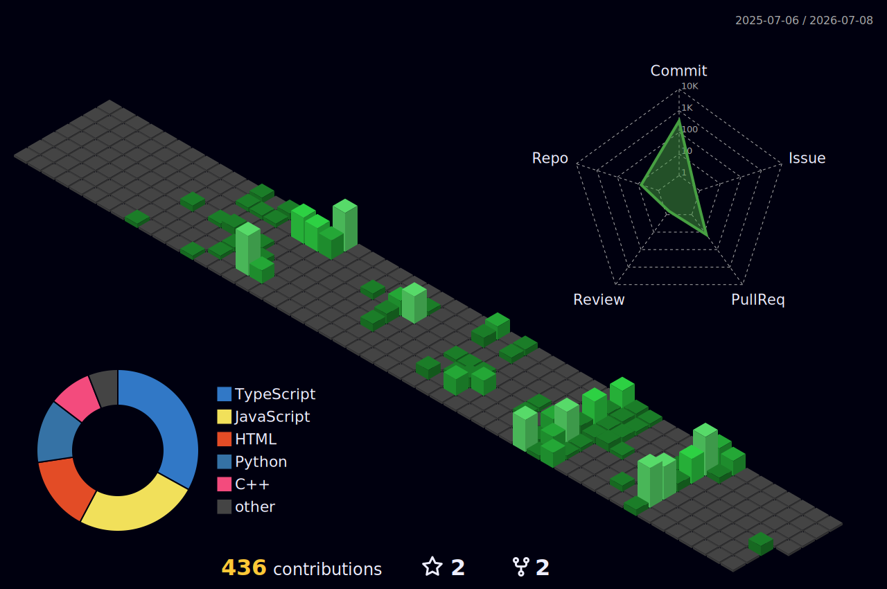

<div align="center">

<!-- Profile Views + Social Badges -->

[](https://linkedin.com/in/nathan-bijo)
[](https://nathanbijo.dev)
[](mailto:nathan.bijo@gmail.com)

<br/>

<!-- Typing SVG Animation -->
[](https://git.io/typing-svg)

</div>

<br/>

<!-- Terminal-style About Block -->
<div align="center">
  
</div>

<br/>

---

## 🛠️ Tech Arsenal

<div align="center">

**Languages**

[](https://skillicons.dev)

**Backend & APIs**

[](https://skillicons.dev)

**Databases & Infra**

[](https://skillicons.dev)

**Frontend & Tools**

[](https://skillicons.dev)

</div>

---

## 📊 GitHub Stats

<div align="center">


</div>

---

## 📊 Contribution Graph


---

<div align="center">

```bash
┌──(nathan㉿dev)-[~/]
└─$ echo "Thanks for visiting. Let's build something."
```

*Open to Backend / Applied AI internships · Available for collabs*

</div>
