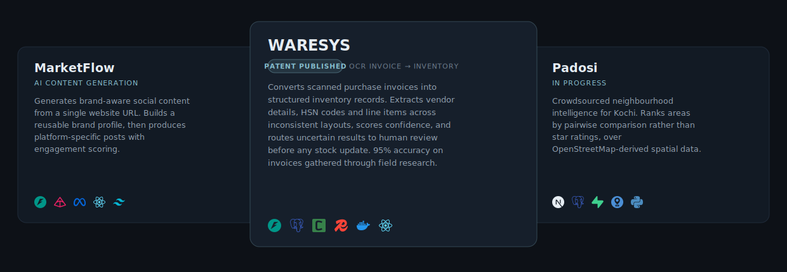

<samp>BACKEND ENGINEERING &nbsp;·&nbsp; APPLIED AI &nbsp;·&nbsp; SOFTWARE SYSTEMS</samp>

  

 

Backends, cryptography, and a weakness for problems that live in the messy part —
crooked invoice scans, streets nobody has mapped, data that refuses to behave.

<samp>**NOW** ▸ building [**Padosi**](https://github.com/Nathanbijo/padosi) · simulation software at STEAG Energy</samp>

 

## Selected Work

<samp>
<a href="https://github.com/Nathanbijo/waresys"><b>WARESYS</b></a> &nbsp;·&nbsp;
<a href="https://github.com/Nathanbijo/marketflow"><b>MarketFlow</b></a> &nbsp;·&nbsp;
<a href="https://github.com/Nathanbijo/padosi"><b>Padosi</b></a>
</samp>

Each repository has its own README with architecture notes and setup.

 

## Stack

&nbsp;&nbsp;&nbsp;&nbsp;&nbsp;&nbsp;&nbsp;&nbsp;
 <samp>LANGUAGES</samp>

 

&nbsp;&nbsp;&nbsp;&nbsp;&nbsp;&nbsp;&nbsp;&nbsp;&nbsp;&nbsp;
 <samp>BACKEND</samp>

 

&nbsp;&nbsp;&nbsp;&nbsp;&nbsp;&nbsp;&nbsp;&nbsp;&nbsp;&nbsp;&nbsp;&nbsp;
 <samp>DATA</samp>

 

&nbsp;&nbsp;&nbsp;&nbsp;&nbsp;&nbsp;
 <samp>APPLIED AI</samp>

 

&nbsp;&nbsp;&nbsp;&nbsp;&nbsp;&nbsp;
 <samp>SIMULATION &amp; UI</samp>

 

&nbsp;&nbsp;&nbsp;&nbsp;&nbsp;&nbsp;&nbsp;&nbsp;
 <samp>INFRA</samp>

 

&nbsp;&nbsp;&nbsp;&nbsp;
 <samp>SECURITY</samp>

 

## Activity

  

 

---

Neurobots finalist · IIT Palakkad &nbsp;·&nbsp; All commits GPG-signed

